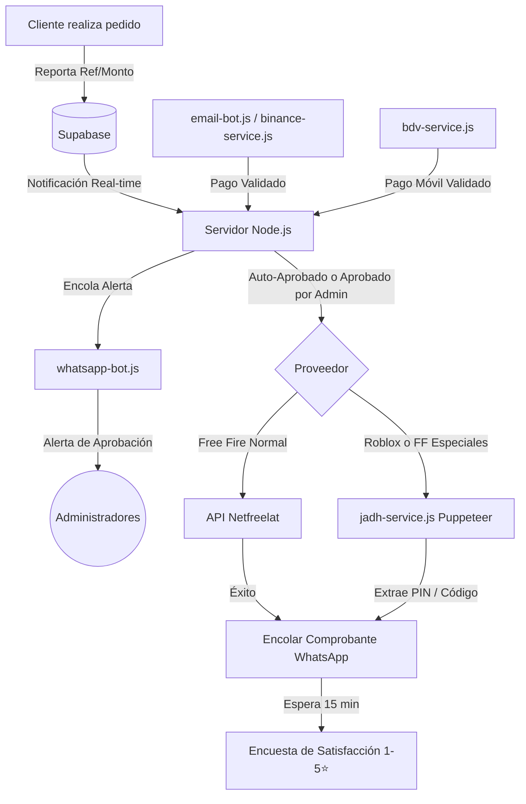

# Estado Actual del Proyecto: RECARGASNEY.COM (Diamond Center Cloud)

Este documento contiene un resumen técnico detallado sobre el estado actual del desarrollo del sistema de recargas automáticas 24/7 **RECARGASNEY.COM** (también conocido como *Diamond Center Cloud* o *ff-id-verificador*). Aquí se detallan los enlaces clave, credenciales, la arquitectura del software, la estructura del proyecto y los flujos automatizados implementados.

---

## 1. 🌐 Enlaces Clave y Acceso al Sistema

### Entornos de Ejecución
*   **Repositorio GitHub:** [netfreelat/diamond-center-cloud](https://github.com/netfreelat/diamond-center-cloud)
*   **Servidor en Producción (Render):** [https://recargasney.com](https://recargasney.com) o [https://diamond-center-cloud.onrender.com](https://diamond-center-cloud.onrender.com)
*   **Servidor Local (Desarrollo):** [http://localhost:3500](http://localhost:3500) *(iniciando con `INICIAR_SERVIDOR.bat`)*

### Paneles de Administración
*   **Panel Admin en Producción:** [https://recargasney.com/admin.html](https://recargasney.com/admin.html)
*   **Panel Admin en Local:** [http://localhost:3500/admin.html](http://localhost:3500/admin.html)
*   **Credenciales por defecto:**
    *   **Usuario:** `admin`
    *   **Contraseña:** Configurada en el archivo `.env` bajo `ADMIN_PASS` (contraseña actual del sistema: `Clifor1988**.`, o `Sneyder12345*#` en `settings.json`).

---

## 2. 📁 Arquitectura del Código y Estructura de Archivos

El sistema está desarrollado sobre **Node.js** con un backend en **Express** y sincronización en tiempo real mediante **Supabase** (PostgreSQL) y **WebSockets**. El frontend es una Web App responsiva de estética gamer.

### Archivos Principales del Proyecto

| Archivo / Carpeta | Propósito |
| :--- | :--- |
| [`server.js`](file:///c:/Users/juanm/Documents/PROYECTOS%20ANTIGRAVITY/solo%20para%20verificar%20id%20de%20free%20fire/server.js) | Servidor backend principal. Maneja las peticiones de los clientes, la API administrativa, la sincronización de inventarios con Supabase y el encolamiento de notificaciones. |
| [`script.js`](file:///c:/Users/juanm/Documents/PROYECTOS%20ANTIGRAVITY/solo%20para%20verificar%20id%20de%20free%20fire/script.js) | Lógica interactiva del cliente. Realiza validaciones, maneja la PWA, gestiona los favoritos locales, procesa Web Push y calcula los montos de conversión en bolívares. |
| [`style.css`](file:///c:/Users/juanm/Documents/PROYECTOS%20ANTIGRAVITY/solo%20para%20verificar%20id%20de%20free%20fire/style.css) | Hoja de estilos con estética *Premium Gamer* (gradientes dinámicos HSL, efectos de cristal / glassmorphism, micro-animaciones en botones e indicadores HUD). |
| [`index.html`](file:///c:/Users/juanm/Documents/PROYECTOS%20ANTIGRAVITY/solo%20para%20verificar%20id%20de%20free%20fire/index.html) | Página de inicio del cliente (interfaz gamer de selección de paquetes, pasarela para reporte de pagos e información general). |
| [`admin.html`](file:///c:/Users/juanm/Documents/PROYECTOS%20ANTIGRAVITY/solo%20para%20verificar%20id%20de%20free%20fire/admin.html) | Panel del administrador. Permite ver pedidos, aprobar/rechazar transacciones, cambiar la tasa de cambio y gestionar inventario. |
| [`whatsapp-bot.js`](file:///c:/Users/juanm/Documents/PROYECTOS%20ANTIGRAVITY/solo%20para%20verificar%20id%20de%20free%20fire/whatsapp-bot.js) | Bot de WhatsApp basado en `whatsapp-web.js`. Procesa la cola de envíos y atiende a clientes y administradores con comandos y encuestas. |
| [`jadh-service.js`](file:///c:/Users/juanm/Documents/PROYECTOS%20ANTIGRAVITY/solo%20para%20verificar%20id%20de%20free%20fire/jadh-service.js) | Servicio automatizado con Puppeteer para iniciar sesión y realizar compras de diamantes, robux y paquetes especiales en `jadh.shop`. |
| [`redeem-service.js`](file:///c:/Users/juanm/Documents/PROYECTOS%20ANTIGRAVITY/solo%20para%20verificar%20id%20de%20free%20fire/redeem-service.js) | Automatización con Puppeteer para el canje automático de códigos de recarga (PINs de 36 caracteres) en `redeempins.com` (Chile). |
| [`bdv-service.js`](file:///c:/Users/juanm/Documents/PROYECTOS%20ANTIGRAVITY/solo%20para%20verificar%20id%20de%20free%20fire/bdv-service.js) | Módulo que interactúa con la banca del Banco de Venezuela (BDV) en línea para extraer movimientos de cuenta y auto-validar transacciones de Pago Móvil. |
| [`binance-service.js`](file:///c:/Users/juanm/Documents/PROYECTOS%20ANTIGRAVITY/solo%20para%20verificar%20id%20de%20free%20fire/binance-service.js) | Servicio que revisa la bandeja de correo Gmail para detectar correos de Binance Pay y auto-aprobar compras abonadas con criptomonedas (USDT). |
| [`email-bot.js`](file:///c:/Users/juanm/Documents/PROYECTOS%20ANTIGRAVITY/solo%20para%20verificar%20id%20de%20free%20fire/email-bot.js) | Lector IMAP para Outlook enfocado en la validación de notificaciones de transferencias / pago móvil del banco Banplus. |
| `manifest.json` y `sw.js` | Configuración de Progressive Web App (PWA) para que los usuarios puedan "descargar" e instalar la tienda en sus dispositivos móviles y recibir notificaciones push en segundo plano. |

### Guiones Ejecutables (Scripts de Arranque y Control)
En la raíz existen múltiples archivos `.bat` para facilitar el control del servidor local:
*   `INICIAR_SERVIDOR.bat`: Levanta el servidor Express local (`node server.js`).
*   `INICIAR_WHATSAPP.bat`: Arranca el cliente de automatización de WhatsApp.
*   `INICIAR_TUNEL.bat`: Levanta un túnel (como localtunnel/ngrok) para pruebas del webhook en local.
*   `ACTUALIZAR_TIENDA.bat`, `CONFIGURAR_WEBHOOK.bat`, `DEPLOY_VPS.bat`: Facilitan el despliegue automático del servidor en VPS linux y configuración de las APIs.

---

## 3. 🔌 Integraciones y Automatizaciones

El núcleo del software radica en su capacidad de reducir a cero la intervención humana para procesar pedidos:

### Detalle de Automatizaciones

1.  **Validación de Pago Móvil (BDV en línea):** 
    El archivo `bdv-service.js` inicia sesión en la plataforma oficial de *BDV en línea* simulando un navegador. Obtiene la lista de movimientos y busca créditos que coincidan con la referencia de pago (últimos 4 u 8 dígitos) y el monto reportado por el usuario en Bolívares.
2.  **Validación de Pago Móvil (Banplus):**
    El archivo `email-bot.js` se conecta al correo Outlook del negocio para leer notificaciones entrantes de Banplus, procesando los montos y referencias de pago móvil al instante.
3.  **Validación de Binance Pay (Gmail IMAP):**
    `binance-service.js` accede de manera segura al Gmail configurado mediante contraseña de aplicaciones y busca notificaciones con asunto "Binance Pay" o del remitente "binance". Si detecta abonos en USDT correctos, los valida para auto-aprobación.
4.  **Recarga Directa de Free Fire (Netfreelat API):**
    Por defecto, las recargas normales de Free Fire se procesan enviando una petición HTTP directa a la API de Netfreelat, la cual recarga el ID del jugador al instante usando el saldo de la plataforma de distribución.
5.  **Recarga de Roblox y Paquetes Especiales (Jadh.shop Bot):**
    Para compras complejas de Roblox y compras de tarjetas de membresía (Básica, Semanal, Mensual, Booyah) de Free Fire, `jadh-service.js` usa Puppeteer para iniciar sesión en la cuenta del comercio en `jadh.shop`, agrega el producto al carrito de compras, ingresa el ID del jugador en la interfaz web y finaliza el pago. Posteriormente, monitoriza el historial del dashboard para confirmar que la transacción se procesó.
6.  **Auto-Canje de Códigos de Roblox (Redeempins Chile Bot):**
    El script `redeem-service.js` automatiza el ingreso de un código / PIN en la web oficial chilena `redeempins.com`, saltando las restricciones de iframe de Hype Games y rellenando los datos del jugador de manera automática para acelerar la entrega de Robux.
7.  **Bot de WhatsApp Interactivo:**
    Implementa el flujo de notificaciones al cliente. Además, los administradores reciben alertas de nuevos pedidos directamente a su teléfono y pueden responder con palabras clave (`Aprobar`, `Rechazar`) o cambiar la tasa del día (`tasa 650`), lo que actualiza la configuración de forma global.

---

## 4. 🗄️ Esquema de Base de Datos (Supabase)

El sistema utiliza las siguientes tablas principales estructuradas en PostgreSQL:

*   **`ff_users`:** Almacena los perfiles de los jugadores (UID, contraseña cifrada, nombre, teléfono, cédula y los puntos acumulados).
*   **`ff_orders`:** Registro histórico de pedidos. Contiene la referencia del pago, el paquete comprado, el método usado, el estado (`pending`, `approved`, `rejected`), el juego respectivo (`freefire`, `roblox`, etc.), dirección IP y código PIN generado en caso de compras en Roblox.
*   **`ff_settings`:** Fila única que actúa como panel de variables de configuración general. Almacena la tasa de cambio actual, la barra informativa deslizante, credenciales de administración, configuraciones de WhatsApp, precios globales y el catálogo dinámico de múltiples juegos.
*   **`ff_pines`:** Gestión de inventario de códigos de recarga pre-cargados en el servidor.
*   **`ff_recientes`:** Registro de las últimas recargas procesadas exitosamente para ser mostradas en el carrusel de la página de inicio (efecto marketing en tiempo real).
*   **`ff_wa_queue`:** Cola de mensajes pendientes por enviar por parte del bot de WhatsApp (evita el bloqueo/baneo del número por parte de Meta, permitiendo espaciar los mensajes).
*   **`ff_pagos_recibidos`:** Historial temporal de referencias bancarias validadas para evitar que los clientes reutilicen capturas de pago móvil.
*   **`ff_push_subscriptions`:** Registros de tokens push de navegadores de los clientes para alertas en segundo plano.
*   **`ff_reviews`:** Registro de calificaciones y opiniones enviadas por los clientes a través del bot de WhatsApp.

---

## 5. ⚙️ Variables de Entorno (`.env`)

El archivo de configuración local `.env` contiene llaves críticas organizadas de la siguiente manera:

*   `TELEGRAM_BOT_TOKEN` y `TELEGRAM_CHAT_ID`: Usadas para alertas y control en canales de Telegram.
*   `SERVER_URL`: Enlace del servidor de backend (ej. `https://recargasney.com`).
*   `NETFREELAT_USER` y `NETFREELAT_PASS`: Credenciales de acceso del distribuidor API Netfreelat.
*   `TEST_MODE`: Modo de simulación (`true` = Simula éxitos en recargas y compras sin consumir saldo ni dinero real; `false` = Producción real en vivo).
*   `EMAIL_USER` y `EMAIL_PASSWORD`: Correo de Outlook para lectura de notificaciones Banplus.
*   `BDV_USER`, `BDV_PASS`, `BDV_CUENTA`, `BDV_MEDIA_HUELLA`, `BDV_F5_COOKIE` y `BDV_TOKEN`: Credenciales técnicas y de sesión para automatizar la consulta de cuentas en el Banco de Venezuela.
*   `BINANCE_EMAIL_USER` y `BINANCE_EMAIL_PASSWORD`: Gmail y contraseña de aplicación para acceder a las notificaciones IMAP de Binance Pay.
*   `SUPABASE_URL` y `SUPABASE_KEY`: Credenciales de conexión al motor de base de datos de Supabase.
*   `VAPID_EMAIL`, `VAPID_PUBLIC_KEY`, `VAPID_PRIVATE_KEY`: Llaves criptográficas asimétricas para las notificaciones Push PWA.
*   `JADH_EMAIL` y `JADH_PASSWORD`: Acceso a la cuenta del proveedor en `jadh.shop`.
*   `PUPPETEER_EXECUTABLE_PATH`: Dirección física del binario de Chromium/Chrome en el servidor VPS de producción.

---

## 6. 🚀 Últimos Avances y Estado del Desarrollo

El proyecto se encuentra en un estado funcional avanzado. Las últimas optimizaciones aplicadas incluyen:
1.  **Fidelización y Puntos de Referidos:** Los usuarios registrados acumulan 10 puntos por cada dólar recargado. Los enlaces de invitación otorgan 10 puntos al referidor una vez que su amigo realiza su primer pedido, alertándole tanto por WhatsApp como por notificación Push.
2.  **Soporte Multijuegos:** Se estructuró la base de datos y el front-end para soportar dinámicamente juegos adicionales a Free Fire (como Roblox y Bloodstrike) usando configuraciones JSON en `ff_settings`.
3.  **Prevención de Duplicados en WhatsApp:** Se instaló un control estricto que evita el reenvío de notificaciones múltiples de un mismo pedido tanto a clientes como a administradores, protegiendo la cola de mensajería `ff_wa_queue`.
4.  **Sistema de Reseñas Post-Venta Automatizado:** El bot de WhatsApp solicita opiniones 15 minutos después de cada recarga exitosa y archiva las calificaciones en la base de datos para mostrarlas en la marquesina de testimonios interactivos del cliente.

---

## 7. 🔗 Mapa Completo de Endpoints de la API

El servidor (`server.js`) usa `http.createServer` nativo de Node.js (sin Express). Todos los endpoints se enrutan mediante comparaciones de `pathname`. A continuación, la lista completa:

### Endpoints Públicos (Cliente)

| Método | Ruta | Descripción |
| :--- | :--- | :--- |
| GET | `/verificar` | Verifica un ID de jugador contra la API de Netfreelat y devuelve el nombre del jugador. |
| POST | `/notificar` | Recibe el pedido del cliente (ID, paquete, método de pago, referencia, WhatsApp) y lo registra. |
| GET | `/recientes` | Devuelve las últimas 10 recargas exitosas (para la marquesina del index). |
| GET | `/historial` | Devuelve el historial de pedidos de un UID específico. |
| GET | `/status` | Estado general del servidor (uptime, usuarios, pedidos, tasa, WhatsApp). |
| GET | `/perfil` | Devuelve datos del perfil del usuario (puntos, nombre, registrado). |
| GET | `/api/config` | Configuración pública: tasa del día, precios, métodos de pago, canal WhatsApp, juegos. |
| GET | `/api/check_password` | Verifica si un UID tiene contraseña configurada (para login de cuenta). |
| POST | `/api/set_password` | Establece o actualiza la contraseña de un usuario. |
| POST | `/api/register` | Registra un nuevo usuario con nombre, apellido, cédula, teléfono y contraseña. |
| POST | `/api/referral` | Registra un código de referido al crear cuenta nueva. |
| POST | `/canjear` | Canjea puntos acumulados por diamantes gratis. |
| GET | `/api/redeem_pin` | Canjea un PIN de diamantes (auto-canje o guía manual). |
| GET | `/api/push/vapid-key` | Devuelve la llave pública VAPID para suscripción Push. |
| POST | `/api/push/subscribe` | Registra un dispositivo para recibir notificaciones push. |
| POST | `/api/push/unsubscribe` | Elimina una suscripción push. |
| GET | `/health` | Healthcheck básico para monitoreo de uptime. |
| GET | `/api/reviews/check` | Verifica si un número de WhatsApp es elegible para dejar reseña. |
| POST | `/api/reviews` | Guarda una reseña/calificación de 1 a 5 estrellas. |

### Endpoints Administrativos (Panel Admin)

| Método | Ruta | Descripción |
| :--- | :--- | :--- |
| POST | `/api/admin/login` | Login del panel administrativo (genera token de sesión). |
| POST | `/api/admin/logout_all` | Cierra todas las sesiones activas del admin. |
| GET | `/admin/stats` | Estadísticas generales (total usuarios, pedidos, ingresos). |
| GET | `/admin/orders/all` | Lista todos los pedidos (paginados) con historial completo. |
| GET | `/admin/pedidos` | Lista los pedidos pendientes actuales. |
| POST | `/admin/aprobar` | Aprueba un pedido y dispara la recarga automática. |
| POST | `/admin/rechazar` | Rechaza un pedido y notifica al cliente por WhatsApp. |
| POST | `/admin/retry-recharge` | Reintenta una recarga que falló en el proveedor. |
| POST | `/admin/clear-wa-queue` | Limpia la cola de mensajes de WhatsApp. |
| POST | `/admin/restart-wa` | Envía señal de reinicio al bot de WhatsApp. |
| POST | `/admin/send-push` | Envía notificación push masiva o a un usuario específico. |
| POST | `/admin/test-binance-payment` | Simula un pago de Binance para pruebas. |
| GET | `/admin/settings` | Obtiene configuración completa del sistema. |
| POST | `/admin/settings` | Actualiza configuración (tasa, precios, métodos de pago, barra informativa). |
| GET | `/admin/usuarios` | Lista todos los usuarios registrados con sus puntos. |
| POST | `/admin/usuarios/update_points` | Modifica los puntos de un usuario manualmente. |
| POST | `/admin/usuarios/set_password` | Reestablece la contraseña de un usuario. |
| POST | `/admin/usuarios/delete` | Elimina un usuario del sistema. |
| GET | `/admin/pines` | Lista el inventario de PINes disponibles. |
| GET | `/admin/pines/used` | Lista los PINes ya usados. |
| GET | `/admin/pines/available` | Lista los PINes disponibles por monto. |
| POST | `/admin/pines/add` | Agrega nuevos PINes al inventario. |
| POST | `/admin/pines/update` | Actualiza un PIN existente. |
| POST | `/admin/pines/delete` | Elimina un PIN del inventario. |
| POST | `/api/admin/wa_broadcast` | Envía un mensaje masivo por WhatsApp a todos los clientes. |
| POST | `/api/admin/wa_broadcast_referrals` | Envía promoción de referidos masiva a usuarios elegibles. |

### Endpoints del Bot WhatsApp (Internos)

| Método | Ruta | Descripción |
| :--- | :--- | :--- |
| GET | `/api/whatsapp_queue` | Devuelve la cola de mensajes pendientes al bot. |
| POST | `/api/whatsapp_sent` | Marca un mensaje como enviado exitosamente. |
| GET | `/api/wa_status` | Devuelve el estado actual del bot (Conectado, QR, Desconectado). |
| POST | `/api/wa_status_update` | Actualiza el estado del bot desde el proceso de WhatsApp. |
| POST | `/webhook` | Webhook de Telegram para comandos remotos. |
| POST | `/webhook/notificacion` | Webhook genérico para notificaciones externas. |

---

## 8. 📱 PWA y Android TWA (Trusted Web Activity)

### Progressive Web App (PWA)
La aplicación funciona como una PWA completa con las siguientes características:
*   **Service Worker** (`sw.js`): Implementa cache-first con network-fallback para todos los assets estáticos. Se excluyen las rutas `/api/` para que siempre consulten la red.
*   **Cache Name:** `diamond-center-v3`
*   **Assets cacheados:** `/`, `/index.html`, `/style.css`, `/script.js`, iconos, `/manifest.json`, páginas legales.
*   **Notificaciones Push:** El Service Worker maneja eventos `push` y `notificationclick` para mostrar notificaciones nativas del sistema operativo y redirigir al usuario al hacer clic.
*   **Atajos de la app** (Shortcuts): 
    *   "Canjear PIN" → `/canjear.html`
    *   "Mi Cuenta" → `/?shortcut=account`

### Android TWA
El archivo `.well-known/assetlinks.json` configura la verificación de Digital Asset Links para una aplicación Android empaquetada como TWA:
*   **Package name:** `com.recargasney.twa`
*   **SHA-256 fingerprint:** `45:A9:EA:84:FC:72:D5:8C:16:9D:1C:92:23:55:2D:8A:4F:E7:DA:82:8A:31:5C:07:61:A2:AF:C2:50:66:CE:AA`

---

## 9. 🖥️ Infraestructura de Despliegue (VPS)

### Servidor VPS
*   **IP del VPS:** `13.140.142.173`
*   **Usuario SSH:** `root`
*   **Directorio de la app:** `/var/www/recargasney`
*   **Dominio:** `recargasney.com` y `www.recargasney.com`
*   **Sistema Operativo:** Ubuntu 22.04 LTS

### Stack de Producción
*   **Node.js 20.x** como runtime del servidor
*   **PM2** como process manager (reinicio automático, monitoreo de memoria, logs)
    *   Proceso principal: `recargasney` → `server.js` (max 3GB RAM)
    *   Proceso WhatsApp: `recargasney-wa` → `whatsapp-bot.js` (max 2GB RAM)
*   **Nginx** como reverse proxy (HTTP → `localhost:3500`, WebSocket → `/ws`)
*   **Certbot** para certificados SSL Let's Encrypt
*   **Chromium-browser** preinstalado para Puppeteer (sin descargar Chromium propio)
*   **UFW Firewall:** Puertos abiertos: SSH, 80 (HTTP), 443 (HTTPS), 3000

### Scripts de Despliegue
*   **`setup-vps.sh`**: Script bash para configuración inicial del VPS desde cero (instala Node, PM2, Nginx, Chromium, firewall y crea el directorio de la app).
*   **`deploy-vps-auto.ps1`**: Script PowerShell que desde Windows sube automáticamente los archivos al VPS vía `pscp`/`plink` (PuTTY), instala dependencias y reinicia los procesos PM2.
*   **`DEPLOY_VPS.bat`**: Ejecuta `deploy-vps-auto.ps1` con un solo doble clic.

### Configuración Nginx
Archivo: `nginx-recargasney.conf`
*   Proxy reverso HTTP → `localhost:3500`
*   Soporte WebSocket en ruta `/ws`
*   `client_max_body_size`: 10MB
*   Timeouts: lectura 300s, conexión 75s
*   En producción incluye bloqueo de archivos sensibles (`.env`, `.git`, `.json`, `.bat`, `.sql`)

---

## 10. 📄 Páginas Web del Sistema

| Página | URL | Descripción |
| :--- | :--- | :--- |
| [index.html](file:///c:/Users/juanm/Documents/PROYECTOS%20ANTIGRAVITY/solo%20para%20verificar%20id%20de%20free%20fire/index.html) | `/` | Tienda principal. Splash screen gamer con crosshair animado y efecto glitch, selector multijuego, tarjetas de paquetes con precios en USDT/Bs, pasarela de pago (Pago Móvil + Binance Pay), sistema de puntos, favoritos y referidos. |
| [admin.html](file:///c:/Users/juanm/Documents/PROYECTOS%20ANTIGRAVITY/solo%20para%20verificar%20id%20de%20free%20fire/admin.html) | `/admin.html` | Panel de control administrativo completo (117KB). Dashboard con estadísticas, gestión de pedidos, usuarios, inventario de PINes, configuración de precios, tasa, métodos de pago, control de WhatsApp bot, envío de notificaciones push masivas y broadcasts. |
| [canjear.html](file:///c:/Users/juanm/Documents/PROYECTOS%20ANTIGRAVITY/solo%20para%20verificar%20id%20de%20free%20fire/canjear.html) | `/canjear.html` | Centro de canje de PINes de diamantes en 3 pasos: (1) Verificar ID, (2) Ingresar PIN, (3) Auto-canje o guía manual con link a redeempins.com. |
| [descargar.html](file:///c:/Users/juanm/Documents/PROYECTOS%20ANTIGRAVITY/solo%20para%20verificar%20id%20de%20free%20fire/descargar.html) | `/descargar.html` | Landing page premium de descarga/instalación de la PWA. Detecta automáticamente Android/iOS/Desktop. Incluye QR code dinámico, estadísticas, instrucciones para iPhone y botón de instalación nativa. |
| [politica-privacidad.html](file:///c:/Users/juanm/Documents/PROYECTOS%20ANTIGRAVITY/solo%20para%20verificar%20id%20de%20free%20fire/politica-privacidad.html) | `/politica-privacidad.html` | Documento legal de política de privacidad. |
| [terminos-condiciones.html](file:///c:/Users/juanm/Documents/PROYECTOS%20ANTIGRAVITY/solo%20para%20verificar%20id%20de%20free%20fire/terminos-condiciones.html) | `/terminos-condiciones.html` | Documento legal de términos y condiciones. |

---

## 11. 🖼️ Imágenes y Assets

| Archivo | Descripción |
| :--- | :--- |
| `icon-192.png`, `icon-512.png`, `icon.svg` | Iconos de la PWA en distintas resoluciones. |
| `badge-diamond.png` | Insignia/badge de diamante para notificaciones push. |
| `fondo.jpg` | Imagen de fondo principal del sitio. |
| `reviews_banner.png` | Banner visual del sistema de testimonios/reseñas. |
| `img/diamante.png` | Imagen decorativa de diamante para paquetes de Free Fire. |
| `img/pase_booyah.png` | Imagen del Pase Booyah para la tienda. |
| `img/roblox.png` | Imagen de Roblox para selector de juegos. |
| `img/roblox_10usd.jpg` | Imagen de tarjeta de regalo Roblox 10 USD. |
| `img/tarjeta_basica.png` | Imagen de Tarjeta Básica Free Fire. |
| `img/tarjeta_semanal.png` | Imagen de Tarjeta Semanal Free Fire. |
| `img/tarjeta_mensual.png` | Imagen de Tarjeta Mensual Free Fire. |

---

## 12. 💰 Catálogo de Precios Actuales

### Paquetes de Diamantes (Free Fire)

| Paquete | Diamantes | Precio USDT | ID Jadh.shop |
| :--- | :--- | :--- | :--- |
| 100 + 10 | 110 | $0.98 | 156 |
| 310 + 31 | 341 | $3.05 | 157 |
| 520 + 52 | 572 | $4.41 | 158 |
| 1,060 + 106 | 1,166 | $8.13 | 159 |
| 2,180 + 218 | 2,376 | $16.01 | 160 |
| 5,600 + 560 | 6,138 | $40.37 | 161 |

### Paquetes Especiales (Free Fire)

| Paquete | Precio USDT | ID Jadh.shop |
| :--- | :--- | :--- |
| 🃏 Tarjeta Básica | $0.75 | 261 |
| 📅 Tarjeta Semanal | $2.80 | 262 |
| 👑 Tarjeta Mensual | $13.50 | 263 |
| 🏆 Pase Booyah | $4.20 | 264 |

### Configuración de Tasa de Cambio
*   **Tasa actual:** 655 Bs/$ (configurable desde el panel admin o vía WhatsApp con el comando `tasa XXX`)
*   **Actualización automática** del dólar habilitada (`AUTO_UPDATE_RATE: true`)

---

## 13. 🧪 Scripts de Utilidad y Diagnóstico (`scratch/`)

La carpeta `scratch/` contiene **57 archivos** de scripts de prueba, diagnóstico y utilidades que han sido usados durante el desarrollo:

| Categoría | Scripts Destacados |
| :--- | :--- |
| **Pruebas de Jadh.shop** | `test-jadh.js`, `check-jadh-catalog.js`, `check-jadh-history2.js`, `scrape-jadh-options.js`, `get_jadh_paquetes.js`, `inspect-dashboard-dom.js`, `probe-products.js` |
| **Pruebas de Roblox** | `test-roblox-flow.js`, `test-roblox-selectors.js`, `roblox_check.js`, `test-bloodstrike-selectors.js` |
| **Pruebas de Pagos** | `test-bdv.js`, `test-binance-service.js`, `test-imap.js` |
| **Gestión de Supabase** | `check-supabase-settings.js`, `check-supabase-table.js`, `update-supabase-roblox.js`, `update_supabase_paquetes.js`, `update-juegos.js`, `search-db.js`, `list-orders.js`, `count_users.js` |
| **Administración** | `check-admin-creds.js`, `reset-admin-password.js`, `check_admin_creds.js`, `restore_users.js` |
| **WhatsApp** | `test-wa-admin-notify.js`, `trigger_broadcast.js` |
| **PWA / Push** | `generate-vapid.js` |
| **Capturas de diagnóstico** | `dashboard.png`, `dashboard_jadh.png`, `diagnostico_roblox.png`, `freefire-auto.png`, `jadh_after_login.png`, `jadh_home.png`, `safe-test-ready.png` |

---

## 14. 📊 Resumen de Números del Proyecto

| Métrica | Valor |
| :--- | :--- |
| Archivo del servidor (`server.js`) | ~3,368 líneas, 174 KB |
| Lógica del cliente (`script.js`) | ~146 KB |
| Panel administrativo (`admin.html`) | ~118 KB |
| Estilos (`style.css`) | ~55 KB |
| Total de archivos en raíz | 70 archivos + 9 subdirectorios |
| Scripts de utilidad (`scratch/`) | 57 archivos |
| Tablas en Supabase | 9 tablas |
| Endpoints API | ~50 rutas |
| Servicios de automatización | 5 (Netfreelat, Jadh, BDV, Binance IMAP, Email Bot) |
| Métodos de pago soportados | 2 (Pago Móvil BDV, Binance Pay USDT) |
| Juegos soportados | 3 (Free Fire, Roblox, Bloodstrike) |
| Plataformas soportadas | PWA (Android, iOS, Desktop) + TWA (Android nativo) |

---

## 15. 📦 Stack de Dependencias Principales

El proyecto depende de los siguientes módulos clave registrados en `package.json` (Motor: Node.js 20.x):

*   **`@supabase/supabase-js`:** Cliente de conexión en tiempo real para PostgreSQL.
*   **`puppeteer`:** Motor de automatización de navegador headless para scraping interactivo (usado en BDV, Jadh y RedeemPins).
*   **`whatsapp-web.js`:** Cliente API no oficial de WhatsApp basado en Web (control remoto de la sesión de WhatsApp vinculada).
*   **`web-push`:** Criptografía y envío de notificaciones push VAPID a navegadores cliente.
*   **`imap` y `mailparser`:** Protocolos de lectura de correos electrónicos para validación bancaria vía Outlook y Gmail.
*   **`ws`:** Implementación del servidor WebSockets ligero para sincronización en vivo del dashboard y clientes.

---

## 16. 🎨 Diseño UI/UX y Frontend Avanzado

La aplicación está diseñada con un enfoque total en la estética y experiencia de usuario (Premium Gamer), lograda enteramente con Vanilla CSS, HTML y JS (sin frameworks pesados).

### Estética y "Look & Feel" (`style.css`)
*   **Glassmorphism (Efecto Cristal):** Tarjetas y paneles semitransparentes con `backdrop-filter: blur()`, sombras sutiles y bordes con opacidad.
*   **Gradientes Dinámicos y Animados:** Botones principales y fondos emplean gradientes de colores vivos (ej. púrpuras, azules neón) que fluyen suavemente.
*   **Micro-animaciones:** Efectos hover (escalado, brillo, pulsaciones), animaciones de carga (spinners tipo "crosshair" de FPS) y un efecto *glitch* cyberpunk en los títulos.
*   **Responsive Design Real:** Adaptable tanto a desktop (vista amplia) como a dispositivos móviles de gama baja, simulando el comportamiento de una App NATIVA.

### Arquitectura Lógica del Cliente (`script.js`)
*   **Sistema de Notificaciones (Toasts):** Sistema nativo de alertas (éxito, error, advertencia) flotantes, configurables y apilables.
*   **Storage y Favoritos:** Gestión de IDs favoritos guardados en `localStorage` para agilizar recargas recurrentes.
*   **Calculadora Reactiva:** Conversión en vivo y automática de USDT a Bolívares usando la tasa extraída del endpoint `/api/config`.
*   **Integración Web Push:** Suscripción reactiva usando el Service Worker para permitir avisos cuando una orden se aprueba, es rechazada o entra un referido.

---

## 17. 🛡️ Seguridad, Autenticación y Control de Errores

El sistema incorpora múltiples capas para proteger la integridad de los datos y evitar abusos:

*   **Validación Estricta de Inputs:** Saneamiento de UIDs (sólo dígitos), números de teléfono y formatos de referencia bancaria para mitigar inyecciones XSS y SQLi en Supabase.
*   **Protección del Webhook y Endpoints:** Los endpoints administrativos (rutas `/admin/*`) requieren un `authToken` generado en el login administrativo.
*   **Prevención de Reutilización de Referencias (Double-Spend):** El motor bancario (BDV y Binance) almacena internamente qué referencias ya fueron utilizadas en `ff_pagos_recibidos`, rechazando cualquier reintento automático.
*   **Bloqueo Anti-Spam de WhatsApp:** La cola `ff_wa_queue` filtra mensajes repetitivos antes de despacharlos al cliente, y existe un límite de envíos por minuto.
*   **Gestión del Estado Global de Puppeteer:** Uso del flag `--no-sandbox` con directorios de perfiles fijos (`userDataDir`) que previene desconexiones imprevistas en los scripts de auto-compra.

---

> **Última actualización de este documento:** 15 de Junio de 2026, 22:07 (Hora de Venezuela, UTC-4)
